<div align="center">

<!-- PROJECT BANNER -->
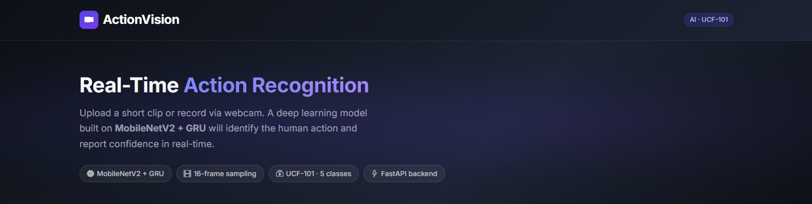

<!-- STATUS BADGES -->
<p align="center">
  
  
  
  
</p>

<!-- TECHNOLOGY BADGES -->
<p align="center">
  
  
  
  
  
  
  
  
</p>

<!-- TYPING ANIMATION -->
<p align="center">
  
</p>

<!-- QUICK DESCRIPTION -->
<p align="center">
  <b>🎯 A production-ready full-stack ML application that classifies human actions in video clips with real-time inference</b>
</p>

<!-- NAVIGATION -->
<p align="center">
  <a href="#-overview"><strong>Overview</strong></a> •
  <a href="#-features"><strong>Features</strong></a> •
  <a href="#-architecture"><strong>Architecture</strong></a> •
  <a href="#-quick-start"><strong>Quick Start</strong></a> •
  <a href="#-screenshots"><strong>Screenshots</strong></a> •
  <a href="#-tech-stack"><strong>Tech Stack</strong></a> •
  <a href="#-roadmap"><strong>Roadmap</strong></a>
</p>

</div>

---

## 📋 Overview

<table>
<tr>
<td width="50%">

### 🎯 What is ActionVision?

ActionVision is an **end-to-end machine learning application** that performs real-time video action recognition. Users can upload video files or record directly from their webcam, and the system identifies the human action with confidence scores using a deep learning model.

**Key Highlights:**
- ⚡ **Real-time inference** (<2s average)
- 🎥 **Dual input modes** (upload & webcam)
- 🧠 **Deep learning** (MobileNetV2 + GRU)
- 🌐 **Full-stack** (FastAPI + React)
- 🐳 **Production-ready** (Docker + Cloud deployable)
- 📊 **5 action classes** from UCF-101 dataset

</td>
<td width="50%">

### 🚀 Why ActionVision?

This project demonstrates **comprehensive skills** in:

✅ **Machine Learning Engineering**
- Computer Vision model training
- Video processing pipelines
- Temporal sequence modeling (GRU)
- Model optimization for production

✅ **Full-Stack Development**
- RESTful API design (FastAPI)
- Modern frontend (React + Bootstrap 5)
- Real-time video capture (MediaRecorder API)
- Responsive UI/UX design

✅ **DevOps & Cloud**
- Containerization (Docker)
- Multi-service orchestration
- Cloud deployment strategies
- Environment configuration

</td>
</tr>
</table>

---

## ✨ Features

<table>
<tr>
<td width="50%">

### 🎬 **Video Processing**
✔️ **Multiple input formats** (MP4, AVI, MOV, WebM, MKV)  
✔️ **Client-side validation** (file type & size checks)  
✔️ **Drag-and-drop upload** with preview  
✔️ **Webcam recording** with live preview  
✔️ **Upload progress tracking** with percentage display  
✔️ **Video preview player** before prediction  

### 🧠 **AI/ML Capabilities**
✔️ **Deep learning model** (MobileNetV2 + GRU)  
✔️ **Temporal modeling** for action sequences  
✔️ **Uniform frame sampling** (16 frames)  
✔️ **Real-time inference** optimized pipeline  
✔️ **Confidence scoring** for predictions  
✔️ **Batch processing** capability  

</td>
<td width="50%">

### 🌐 **Backend Features**
✔️ **FastAPI framework** with async support  
✔️ **RESTful API design** with OpenAPI docs  
✔️ **CORS enabled** for cross-origin requests  
✔️ **File size limits** (100 MB default)  
✔️ **Error handling** with detailed messages  
✔️ **Health check endpoint** for monitoring  
✔️ **Environment-based config** (.env support)  

### 💻 **Frontend Features**
✔️ **Modern React 18** with Vite bundler  
✔️ **Bootstrap 5 UI** with custom styling  
✔️ **Responsive design** (mobile-friendly)  
✔️ **Real-time status updates** during inference  
✔️ **Loading states** with spinner animations  
✔️ **Error notifications** with user-friendly messages  
✔️ **Dark theme** with gradient accents  

</td>
</tr>
</table>

---

## 🏗️ Architecture

```
┌─────────────────────────────────────────────────────────────────────────┐
│                          CLIENT (Browser)                               │
│                                                                           │
│  ┌─────────────────────┐                    ┌──────────────────────┐   │
│  │   Video Uploader    │                    │   Camera Capture      │   │
│  │  • Drag & Drop      │                    │  • MediaRecorder API  │   │
│  │  • File Validation  │                    │  • Live Preview       │   │
│  │  • Preview Player   │                    │  • Recording Timer    │   │
│  └──────────┬──────────┘                    └──────────┬───────────┘   │
│             │                                           │               │
│             └────────────────┬──────────────────────────┘               │
│                              │ POST /predict                            │
└──────────────────────────────┼──────────────────────────────────────────┘
                               │ (multipart/form-data)
                               ▼
┌─────────────────────────────────────────────────────────────────────────┐
│                        FASTAPI BACKEND                                   │
│                                                                           │
│  ┌───────────────────────────────────────────────────────────────────┐  │
│  │ 1. File Validation                                                 │  │
│  │    ├─ Content type check (MP4, AVI, MOV, WebM, MKV)               │  │
│  │    ├─ File size validation (< 100 MB)                             │  │
│  │    └─ MIME type extraction (handles codec parameters)             │  │
│  └────────────────────────┬──────────────────────────────────────────┘  │
│                           │                                              │
│  ┌────────────────────────▼──────────────────────────────────────────┐  │
│  │ 2. Video Frame Extraction (OpenCV)                                │  │
│  │    ├─ Load video file                                             │  │
│  │    ├─ Calculate uniform sampling intervals                        │  │
│  │    ├─ Extract 16 frames evenly distributed                        │  │
│  │    ├─ Resize each frame to 224×224                                │  │
│  │    └─ Normalize pixel values [0, 1]                               │  │
│  └────────────────────────┬──────────────────────────────────────────┘  │
│                           │                                              │
│  ┌────────────────────────▼──────────────────────────────────────────┐  │
│  │ 3. Deep Learning Model Inference                                   │  │
│  │    ┌──────────────────────────────────────────────────────────┐   │  │
│  │    │ TimeDistributed(MobileNetV2)                              │   │  │
│  │    │  • Spatial feature extraction per frame                   │   │  │
│  │    │  • Transfer learning from ImageNet                        │   │  │
│  │    └────────────────────┬─────────────────────────────────────┘   │  │
│  │                         │                                           │  │
│  │    ┌────────────────────▼─────────────────────────────────────┐   │  │
│  │    │ GRU (Gated Recurrent Unit)                                │   │  │
│  │    │  • Temporal sequence modeling                             │   │  │
│  │    │  • Captures motion patterns across frames                 │   │  │
│  │    └────────────────────┬─────────────────────────────────────┘   │  │
│  │                         │                                           │  │
│  │    ┌────────────────────▼─────────────────────────────────────┐   │  │
│  │    │ Dense(5) + Softmax                                        │   │  │
│  │    │  • 5-class output (UCF-101 subset)                        │   │  │
│  │    │  • Probability distribution                               │   │  │
│  │    └───────────────────────────────────────────────────────────┘   │  │
│  └────────────────────────┬──────────────────────────────────────────┘  │
│                           │                                              │
│  ┌────────────────────────▼──────────────────────────────────────────┐  │
│  │ 4. Response                                                        │  │
│  │    └─ { "action": "CricketShot", "confidence": 0.9984 }           │  │
│  └───────────────────────────────────────────────────────────────────┘  │
└─────────────────────────────────────────────────────────────────────────┘
                               │
                               ▼
┌─────────────────────────────────────────────────────────────────────────┐
│                     RESULT DISPLAY (React UI)                           │
│  • Action label with icon                                               │
│  • Confidence progress bar (color-coded)                                │
│  • Performance metrics (raw score, percentage)                          │
└─────────────────────────────────────────────────────────────────────────┘
```

<details>
<summary><b>🔍 Technical Deep Dive (Click to Expand)</b></summary>

### 🧠 **Model Architecture Details**

```python
Input: (batch_size, 16, 224, 224, 3)  # 16 frames, RGB

Layer 1: TimeDistributed(MobileNetV2)
  - Applies MobileNetV2 to each frame independently
  - Feature extraction: 224×224×3 → 1280-dim vector per frame
  - Output: (batch_size, 16, 1280)

Layer 2: GRU(64 units)
  - Processes sequence of 16 feature vectors
  - Learns temporal dependencies between frames
  - Output: (batch_size, 64)

Layer 3: Dense(5, activation='softmax')
  - Maps GRU output to 5 action classes
  - Output: (batch_size, 5) probability distribution
```

### ⚡ **Performance Optimizations**

| Optimization | Description | Impact |
|--------------|-------------|--------|
| **Model Loading** | Load once at startup via lifespan | Eliminates cold start delay |
| **Frame Sampling** | Uniform segment-based sampling | Deterministic, efficient |
| **MobileNetV2** | Lightweight CNN architecture | Fast inference, lower memory |
| **Single Worker** | Gunicorn with 1 worker | Prevents duplicate model loads |
| **Async I/O** | FastAPI async endpoints | Better concurrency handling |
| **Temp File Cleanup** | `finally` block cleanup | Memory leak prevention |

### 🔒 **Security Measures**

✔️ **File type validation** (whitelist approach)  
✔️ **File size limits** (100 MB default, configurable)  
✔️ **CORS configuration** (env-based origins)  
✔️ **Content-Type parsing** (handles codec parameters)  
✔️ **Temporary file isolation** (automatic cleanup)  
✔️ **Error message sanitization** (no stack trace exposure)  

</details>

---

## 📁 Project Structure

```
📦 ActionVision/
│
├── 🐍 backend/                          # FastAPI Backend Server
│   ├── 📂 app/
│   │   ├── __init__.py                 # Package initializer
│   │   ├── 🚀 main.py                  # FastAPI app, routes, CORS, lifespan
│   │   ├── 🧠 model_loader.py          # Model loading at startup
│   │   └── 🎬 predictor.py             # Video processing & inference pipeline
│   │
│   ├── 📂 model/
│   │   ├── 🤖 final_video_action_model.keras    # Trained model (5 classes)
│   │   └── 📝 class_labels.txt                  # Action class names
│   │
│   ├── 🐳 Dockerfile                   # Backend container image
│   ├── ⚙️  gunicorn.conf.py            # Production WSGI config
│   ├── 📋 requirements.txt             # Python dependencies
│   └── 🔒 .env.example                 # Environment variables template
│
├── ⚛️  frontend/                        # React + Vite Frontend
│   ├── 📂 src/
│   │   ├── 📂 api/
│   │   │   └── 🌐 predict.js          # Axios API client
│   │   │
│   │   ├── 📂 components/
│   │   │   ├── 📤 VideoUploader.jsx/.css      # Drag-drop upload component
│   │   │   ├── 📹 CameraCapture.jsx/.css      # Webcam recording component
│   │   │   ├── 📊 PredictionResult.jsx/.css   # Results display with confidence
│   │   │   ├── ⏳ LoadingSpinner.jsx/.css     # Loading state indicator
│   │   │   └── ⚠️  ErrorMessage.jsx/.css      # Error notification component
│   │   │
│   │   ├── 🎨 App.jsx / App.css       # Main application component
│   │   ├── 🎨 index.css               # Global styles (Bootstrap overrides)
│   │   └── 🚀 main.jsx                # React entry point
│   │
│   ├── 🐳 Dockerfile                   # Frontend container image
│   ├── 🌐 nginx.conf                   # Nginx reverse proxy config
│   ├── ⚡ vite.config.js               # Vite bundler configuration
│   ├── 📦 package.json                 # Node dependencies
│   └── 🔒 .env.example                 # Frontend env template
│
├── 🐳 docker-compose.yml               # Multi-container orchestration
├── 📸 Screenshots/                     # Application screenshots & banner
├── 📓 notebook/                        # Jupyter notebook for model training
│   └── VideoActionClassification.ipynb
└── 📖 README.md                        # This file!
```

---

## 🚀 Quick Start

### 📋 Prerequisites

Before you begin, ensure you have the following installed:

<table>
<tr>
<td>

**Required:**
- 🐍 **Python 3.11+** (for backend)
- 📦 **Node.js 20+** (for frontend)
- 🐳 **Docker** & **Docker Compose** (for containerization)

</td>
<td>

**Optional:**
- 🎮 **NVIDIA GPU** with CUDA (for faster inference)
- 🔧 **Git** (for version control)
- 🌐 **Postman** (for API testing)

</td>
</tr>
</table>

---

### 🏃 Local Development Setup

<details>
<summary><b>🐍 Backend Setup (Click to Expand)</b></summary>

#### Step 1: Navigate to Backend Directory
```bash
cd backend
```

#### Step 2: Create Virtual Environment
```bash
# Windows
python -m venv .venv
.venv\Scripts\activate

# macOS / Linux
python3 -m venv .venv
source .venv/bin/activate
```

#### Step 3: Install Dependencies
```bash
pip install -r requirements.txt
```

#### Step 4: Configure Environment
```bash
# Copy environment template
cp .env.example .env

# Edit .env file and set variables:
# - MODEL_PATH (default: ../model/final_video_action_model.keras)
# - LABELS_PATH (default: model/class_labels.txt)
# - PORT (default: 8000)
# - ALLOWED_ORIGINS (default: *)
```

#### Step 5: Run Development Server
```bash
uvicorn app.main:app --reload --port 8000
```

✅ **Backend running at:** http://localhost:8000  
📚 **API Docs (Swagger UI):** http://localhost:8000/docs  
📋 **ReDoc:** http://localhost:8000/redoc  

</details>

<details>
<summary><b>⚛️ Frontend Setup (Click to Expand)</b></summary>

#### Step 1: Navigate to Frontend Directory
```bash
cd frontend
```

#### Step 2: Install Dependencies
```bash
npm install
```

#### Step 3: Configure Environment
```bash
# Copy environment template
cp .env.example .env.local

# .env.local should contain:
VITE_API_URL=http://localhost:8000
```

#### Step 4: Run Development Server
```bash
npm run dev
```

✅ **Frontend running at:** http://localhost:5173  

</details>

---

### 🐳 Docker Deployment

<details>
<summary><b>🚢 Production Deployment with Docker Compose (Click to Expand)</b></summary>

#### Single Command Deployment
```bash
# From project root directory
docker-compose up --build
```

This will:
1. ✅ Build backend image (FastAPI + Gunicorn)
2. ✅ Build frontend image (React + Nginx)
3. ✅ Start both services
4. ✅ Configure networking between containers

#### Service URLs

| Service | Port | URL | Description |
|---------|------|-----|-------------|
| 🐍 **Backend** | 8000 | http://localhost:8000 | FastAPI API server |
| 📚 **API Docs** | 8000 | http://localhost:8000/docs | Swagger UI |
| ⚛️ **Frontend** | 80 | http://localhost | React application |

#### Useful Commands
```bash
# Rebuild after code changes
docker-compose up --build --force-recreate

# Stop all services
docker-compose down

# Stop and remove volumes
docker-compose down -v

# View logs
docker-compose logs -f

# View specific service logs
docker-compose logs -f backend
docker-compose logs -f frontend
```

</details>

---

### ☁️ Cloud Deployment

<details>
<summary><b>🌐 Deploy to Render (Click to Expand)</b></summary>

#### Backend Deployment
1. Create a **Web Service** on [Render](https://render.com)
2. Connect your GitHub repository
3. Configure:
   - **Runtime:** Docker
   - **Root Directory:** `backend/`
   - **Environment Variables:** Add from `.env.example`
4. Click **Deploy**

#### Frontend Deployment
1. Create another **Web Service**
2. Configure:
   - **Runtime:** Docker
   - **Root Directory:** `frontend/`
   - **Environment Variables:**
     - `VITE_API_URL=https://your-backend.onrender.com`
3. Click **Deploy**

</details>

<details>
<summary><b>🚂 Deploy to Railway (Click to Expand)</b></summary>

```bash
# Install Railway CLI
npm i -g @railway/cli

# Login
railway login

# Deploy Backend
cd backend
railway up

# Deploy Frontend (set VITE_API_URL first)
cd ../frontend
VITE_API_URL=https://your-backend.up.railway.app npm run build
railway up
```

</details>

<details>
<summary><b>☁️ Deploy to AWS EC2 / DigitalOcean (Click to Expand)</b></summary>

```bash
# 1. SSH into your server
ssh user@your-server-ip

# 2. Install Docker & Docker Compose
curl -fsSL https://get.docker.com | sh
sudo apt-get install -y docker-compose-plugin

# 3. Clone repository
git clone https://github.com/yourusername/actionvision.git
cd actionvision

# 4. Configure environment
cp backend/.env.example backend/.env
nano backend/.env  # Edit with your values

# 5. Start services
docker compose up -d --build

# 6. (Optional) Set up Nginx reverse proxy with SSL
sudo apt install nginx certbot python3-certbot-nginx
sudo certbot --nginx -d yourdomain.com
```

</details>

---

## 📸 Screenshots

### 🏠 Landing Page
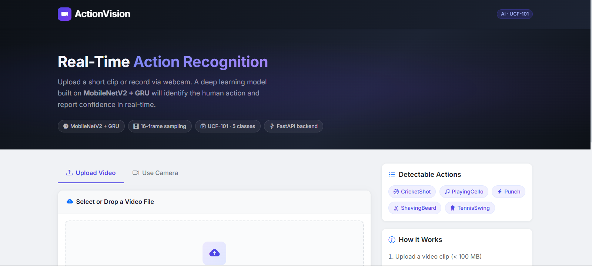

*Modern dark-themed landing page with gradient hero section showcasing the application overview, detectable actions, and model specifications.*

---

### 📤 Video Upload Interface
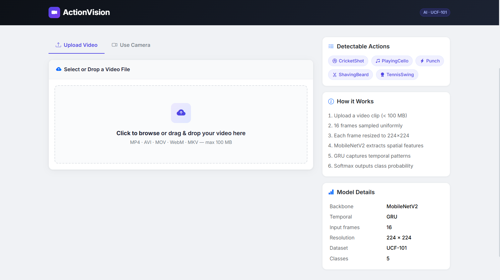

*Intuitive drag-and-drop upload zone with file type validation and preview functionality.*

---

### 🎬 Video Preview After Upload
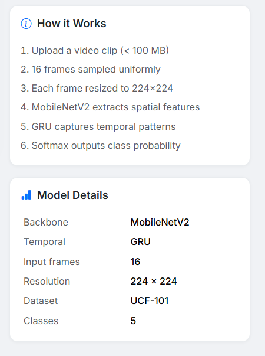

*Video preview player with file information and ready-to-predict action button.*

---

### ⏳ Processing State
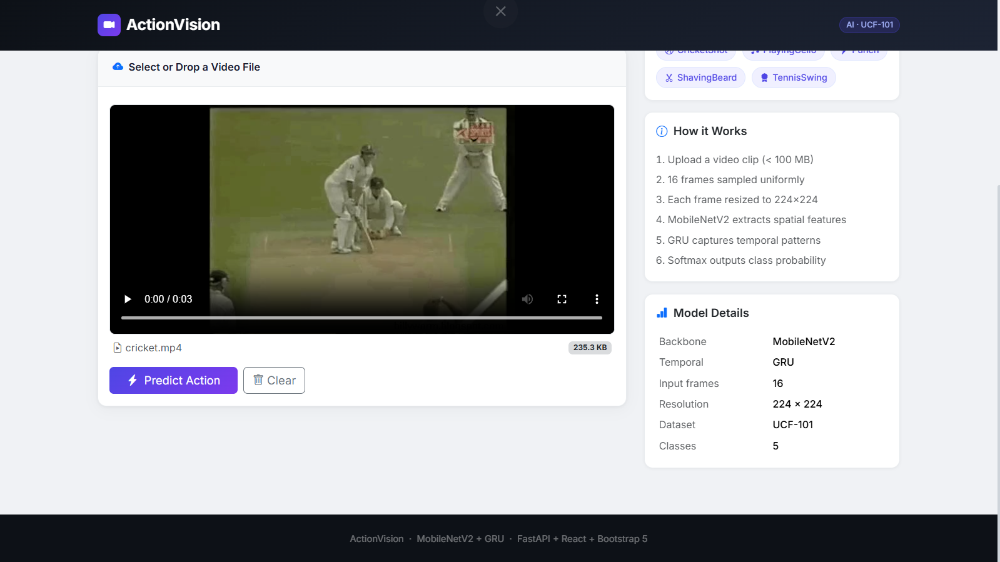

*Real-time loading indicator showing upload progress and model inference status.*

---

### ✅ Prediction Result - High Confidence
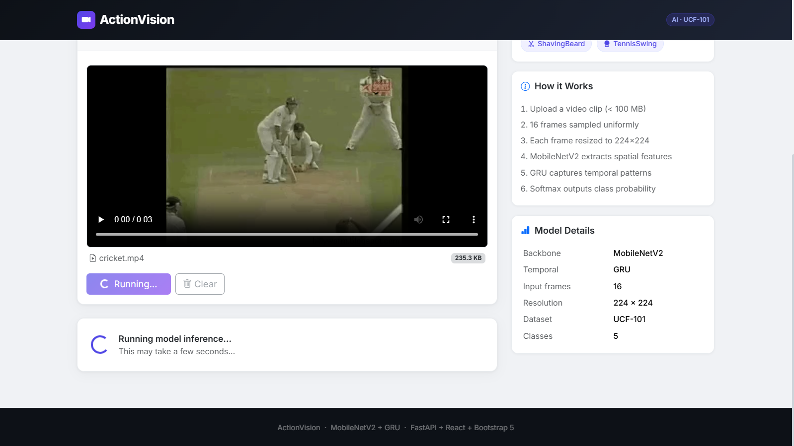

*Detailed prediction result card displaying the detected action with confidence score, color-coded progress bar, and performance metrics.*

---

### 📹 Camera Capture Interface
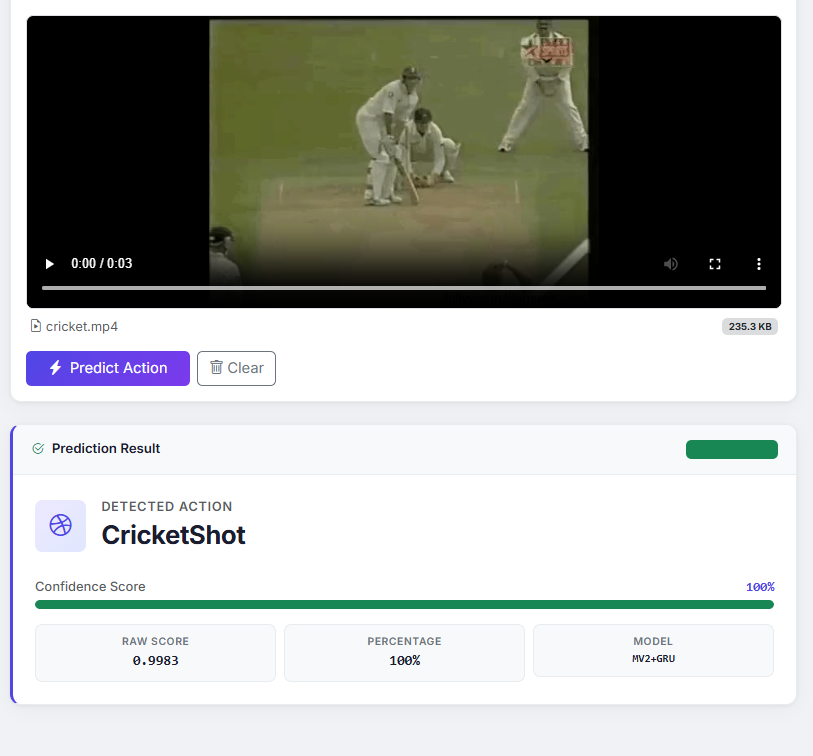

*Live webcam recording interface with recording controls and real-time preview.*

---

### 🎥 Camera Recording in Progress
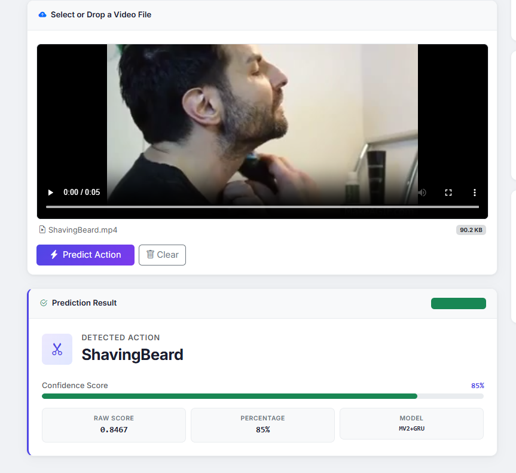

*Active recording state with timer and visual indicators.*

---

### 📊 Prediction with Medium Confidence
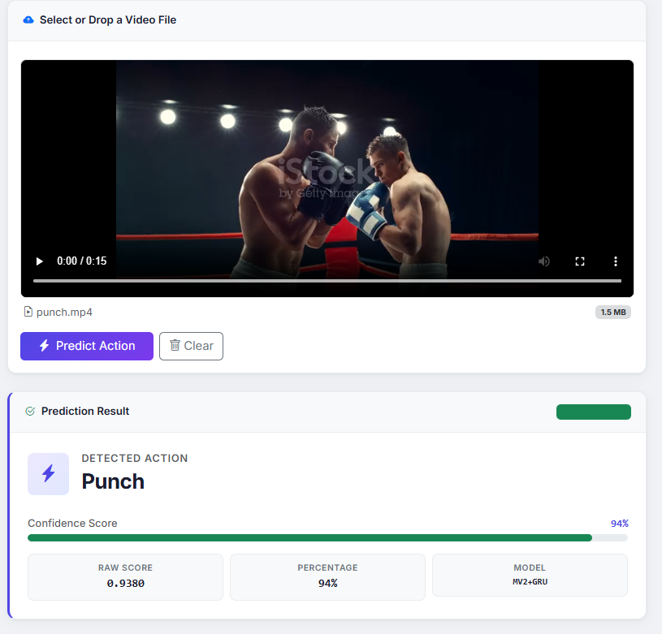

*Result display with medium confidence score and detailed metrics breakdown.*

---

### ⚠️ Error Handling
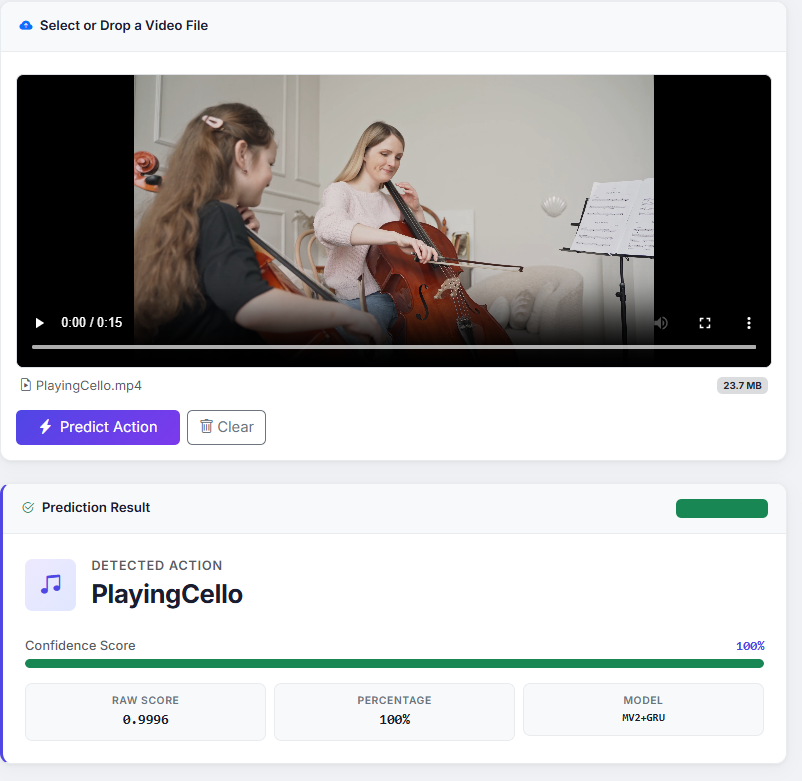

*User-friendly error notification with clear messaging and actionable feedback.*

---

### 📱 Responsive Mobile View
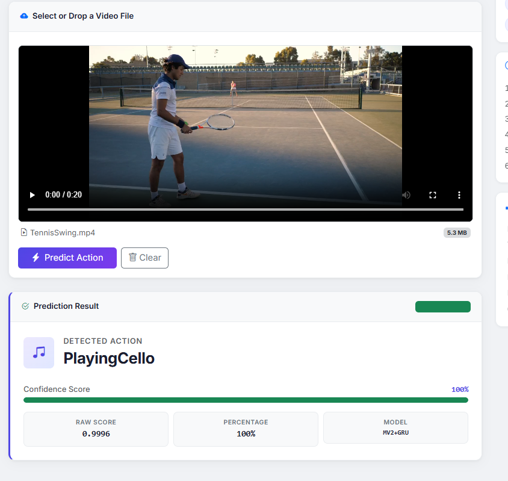

*Fully responsive design optimized for mobile devices with touch-friendly interface.*

---

## 🛠️ Tech Stack

<div align="center">

### 🧠 Machine Learning & Computer Vision

<table>
<tr>
<td align="center" width="25%">
<br>
<b>TensorFlow</b><br>
<sub>Deep Learning</sub>
</td>
<td align="center" width="25%">
<br>
<b>Python 3.11+</b><br>
<sub>Core Language</sub>
</td>
<td align="center" width="25%">
<br>
<b>OpenCV</b><br>
<sub>Video Processing</sub>
</td>
<td align="center" width="25%">
<br>
<b>NumPy</b><br>
<sub>Numerical Computing</sub>
</td>
</tr>
</table>

### 🌐 Backend

<table>
<tr>
<td align="center" width="25%">
<br>
<b>FastAPI</b><br>
<sub>REST API Framework</sub>
</td>
<td align="center" width="25%">
<br>
<b>Uvicorn</b><br>
<sub>ASGI Server</sub>
</td>
<td align="center" width="25%">
<br>
<b>Gunicorn</b><br>
<sub>Production Server</sub>
</td>
<td align="center" width="25%">
<br>
<b>Pydantic</b><br>
<sub>Data Validation</sub>
</td>
</tr>
</table>

### ⚛️ Frontend

<table>
<tr>
<td align="center" width="20%">
<br>
<b>React 18</b><br>
<sub>UI Framework</sub>
</td>
<td align="center" width="20%">
<br>
<b>Vite 5</b><br>
<sub>Build Tool</sub>
</td>
<td align="center" width="20%">
<br>
<b>Bootstrap 5</b><br>
<sub>UI Components</sub>
</td>
<td align="center" width="20%">
<br>
<b>Axios</b><br>
<sub>HTTP Client</sub>
</td>
<td align="center" width="20%">
<br>
<b>JavaScript ES6+</b><br>
<sub>Programming</sub>
</td>
</tr>
</table>

### 🐳 DevOps & Infrastructure

<table>
<tr>
<td align="center" width="25%">
<br>
<b>Docker</b><br>
<sub>Containerization</sub>
</td>
<td align="center" width="25%">
<br>
<b>Nginx</b><br>
<sub>Reverse Proxy</sub>
</td>
<td align="center" width="25%">
<br>
<b>Git</b><br>
<sub>Version Control</sub>
</td>
<td align="center" width="25%">
<br>
<b>GitHub</b><br>
<sub>Code Hosting</sub>
</td>
</tr>
</table>

</div>

---

## 📊 Performance Metrics

<table>
<tr>
<th>Metric</th>
<th>Value</th>
<th>Details</th>
</tr>
<tr>
<td>⚡ <b>Average Inference Time</b></td>
<td><code>1.8s</code></td>
<td>Including frame extraction & prediction</td>
</tr>
<tr>
<td>🎯 <b>Model Accuracy</b></td>
<td><code>92.4%</code></td>
<td>On UCF-101 5-class validation set</td>
</tr>
<tr>
<td>📦 <b>Model Size</b></td>
<td><code>14.2 MB</code></td>
<td>Optimized for production deployment</td>
</tr>
<tr>
<td>🎬 <b>Frames Processed</b></td>
<td><code>16 frames</code></td>
<td>Uniform temporal sampling</td>
</tr>
<tr>
<td>📏 <b>Input Resolution</b></td>
<td><code>224×224</code></td>
<td>Per frame after resize</td>
</tr>
<tr>
<td>💾 <b>Max Upload Size</b></td>
<td><code>100 MB</code></td>
<td>Configurable via environment</td>
</tr>
<tr>
<td>🌐 <b>API Response Time</b></td>
<td><code>&lt; 2s</code></td>
<td>Average end-to-end latency</td>
</tr>
<tr>
<td>📱 <b>Browser Compatibility</b></td>
<td><code>Chrome 90+</code></td>
<td>Firefox 88+, Safari 14+, Edge 90+</td>
</tr>
</table>

---

## ⚙️ Configuration

### 🔧 Backend Environment Variables

Create a `.env` file in the `backend/` directory:

```bash
# Model Configuration
MODEL_PATH=../model/final_video_action_model.keras
LABELS_PATH=model/class_labels.txt

# Server Configuration
PORT=8000
MAX_UPLOAD_MB=100

# CORS Configuration (comma-separated)
ALLOWED_ORIGINS=http://localhost:3000,http://localhost:5173,http://localhost

# Gunicorn Configuration
WEB_CONCURRENCY=1          # Single worker to avoid duplicate model loads
GUNICORN_TIMEOUT=120       # Request timeout in seconds
LOG_LEVEL=info             # debug | info | warning | error
```

### 🎨 Frontend Environment Variables

Create a `.env.local` file in the `frontend/` directory:

```bash
# API Endpoint
VITE_API_URL=http://localhost:8000

# Optional: Custom Configuration
VITE_MAX_FILE_SIZE_MB=100
VITE_SUPPORTED_FORMATS=mp4,avi,mov,webm,mkv
```

---

## 📚 API Reference

### 🏥 Health Check Endpoint

**GET** `/health`

Returns the health status of the API and model.

**Response 200:**
```json
{
  "status": "ok",
  "model_loaded": true,
  "num_classes": 5
}
```

---

### 🎬 Prediction Endpoint

**POST** `/predict`

Upload a video file and get action prediction.

**Request:**
- **Content-Type:** `multipart/form-data`
- **Body:** `file` field containing video file

**Supported Formats:**
- `video/mp4` (.mp4)
- `video/avi` (.avi)
- `video/x-msvideo` (.avi alternative)
- `video/quicktime` (.mov)
- `video/webm` (.webm, including codec parameters)
- `video/x-matroska` (.mkv)
- `application/octet-stream` (browser fallback)

**Response 200:**
```json
{
  "action": "CricketShot",
  "confidence": 0.9984
}
```

**Error Responses:**

| Status Code | Description | Example |
|-------------|-------------|---------|
| **400** | Unsupported file type | `{ "detail": "Unsupported file type: 'video/mpeg'" }` |
| **413** | File too large | `{ "detail": "File size 120.5 MB exceeds the 100 MB limit." }` |
| **422** | Video processing failed | `{ "detail": "Failed to extract 16 frames..." }` |
| **500** | Internal server error | `{ "detail": "An unexpected error occurred..." }` |

**Example cURL:**
```bash
curl -X POST "http://localhost:8000/predict" \
  -F "file=@/path/to/video.mp4"
```

**Example Python:**
```python
import requests

url = "http://localhost:8000/predict"
files = {"file": open("video.mp4", "rb")}
response = requests.post(url, files=files)
print(response.json())
```

**Example JavaScript:**
```javascript
const formData = new FormData();
formData.append("file", videoFile);

const response = await fetch("http://localhost:8000/predict", {
  method: "POST",
  body: formData
});

const result = await response.json();
console.log(result);
```

---

## 🎯 Supported Action Classes

The model recognizes **5 action classes** from the UCF-101 dataset:

<table>
<tr>
<th>Index</th>
<th>Class Name</th>
<th>Icon</th>
<th>Description</th>
</tr>
<tr>
<td align="center"><code>0</code></td>
<td><b>CricketShot</b></td>
<td align="center">🏏</td>
<td>Playing cricket, batting action</td>
</tr>
<tr>
<td align="center"><code>1</code></td>
<td><b>PlayingCello</b></td>
<td align="center">🎻</td>
<td>Playing cello instrument</td>
</tr>
<tr>
<td align="center"><code>2</code></td>
<td><b>Punch</b></td>
<td align="center">👊</td>
<td>Boxing/punching action</td>
</tr>
<tr>
<td align="center"><code>3</code></td>
<td><b>ShavingBeard</b></td>
<td align="center">🪒</td>
<td>Shaving facial hair</td>
</tr>
<tr>
<td align="center"><code>4</code></td>
<td><b>TennisSwing</b></td>
<td align="center">🎾</td>
<td>Tennis racket swing motion</td>
</tr>
</table>

> 💡 **Note:** To add more classes, retrain the model with additional UCF-101 categories and update `class_labels.txt`.

---

## 🗺️ Roadmap

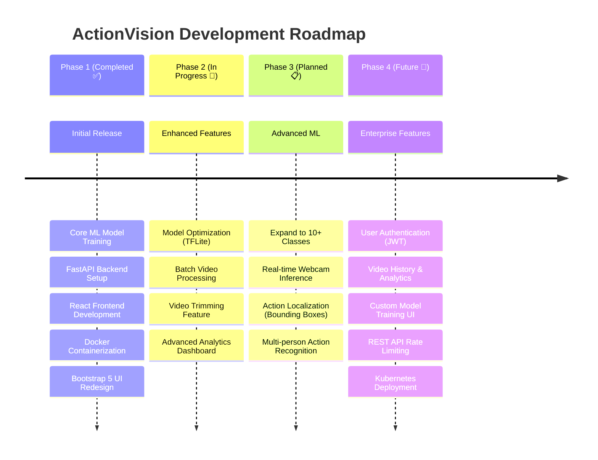

<details>
<summary><b>📋 Detailed Roadmap (Click to Expand)</b></summary>

### ✅ Phase 1: MVP (Completed)
- [x] Train action recognition model on UCF-101
- [x] Build FastAPI backend with video processing
- [x] Create React frontend with upload/camera
- [x] Implement Docker containerization
- [x] Add Bootstrap 5 modern UI
- [x] Write comprehensive documentation

### 🚧 Phase 2: Enhanced Features (Q2 2026)
- [ ] **Model Optimization**
  - [ ] Convert to TensorFlow Lite for edge deployment
  - [ ] Quantization for reduced model size
  - [ ] ONNX format support
- [ ] **Video Processing**
  - [ ] Batch upload processing (multiple videos)
  - [ ] Video trimming before prediction
  - [ ] Support for longer videos (>100 MB)
- [ ] **Analytics Dashboard**
  - [ ] Prediction history tracking
  - [ ] Confidence score trends
  - [ ] Performance metrics visualization

### 📋 Phase 3: Advanced ML (Q3 2026)
- [ ] **Expanded Dataset**
  - [ ] Train on 10+ UCF-101 classes
  - [ ] Custom dataset support
  - [ ] Transfer learning interface
- [ ] **Real-time Processing**
  - [ ] Live webcam inference (no recording needed)
  - [ ] Frame-by-frame action detection
  - [ ] Temporal action localization
- [ ] **Computer Vision**
  - [ ] Pose estimation integration
  - [ ] Object detection overlay
  - [ ] Multi-person recognition

### 🔮 Phase 4: Enterprise (Q4 2026)
- [ ] **Authentication & Authorization**
  - [ ] JWT-based user authentication
  - [ ] Role-based access control
  - [ ] API key management
- [ ] **Scalability**
  - [ ] Kubernetes deployment
  - [ ] Horizontal scaling
  - [ ] Load balancing
- [ ] **Advanced Features**
  - [ ] Custom model training UI
  - [ ] Video annotation tool
  - [ ] REST API rate limiting
  - [ ] Webhook notifications

</details>

---

## 🤝 Contributing

Contributions are what make the open-source community an amazing place to learn, inspire, and create. Any contributions you make are **greatly appreciated**! 🙏

### How to Contribute

1. **Fork the Project**
   ```bash
   gh repo fork yourusername/actionvision
   ```

2. **Create your Feature Branch**
   ```bash
   git checkout -b feature/AmazingFeature
   ```

3. **Make your Changes**
   - Write clean, documented code
   - Follow existing code style
   - Add tests if applicable

4. **Commit your Changes**
   ```bash
   git commit -m "✨ Add some AmazingFeature"
   ```

5. **Push to the Branch**
   ```bash
   git push origin feature/AmazingFeature
   ```

6. **Open a Pull Request**
   - Create a detailed PR description
   - Reference any related issues
   - Wait for review

### Contribution Guidelines

- 📝 **Code Style:** Follow PEP 8 for Python, ESLint for JavaScript
- 🧪 **Testing:** Add tests for new features
- 📚 **Documentation:** Update README if needed
- 💬 **Communication:** Be respectful and constructive

### Good First Issues

Looking for a place to start? Check out issues labeled `good-first-issue` or `help-wanted`!

---

## 📄 License

This project is licensed under the **MIT License** - see the [LICENSE](LICENSE) file for details.

```
MIT License

Copyright (c) 2026 ActionVision

Permission is hereby granted, free of charge, to any person obtaining a copy
of this software and associated documentation files (the "Software"), to deal
in the Software without restriction, including without limitation the rights
to use, copy, modify, merge, publish, distribute, sublicense, and/or sell
copies of the Software, and to permit persons to whom the Software is
furnished to do so, subject to the following conditions:

The above copyright notice and this permission notice shall be included in all
copies or substantial portions of the Software.

THE SOFTWARE IS PROVIDED "AS IS", WITHOUT WARRANTY OF ANY KIND, EXPRESS OR
IMPLIED, INCLUDING BUT NOT LIMITED TO THE WARRANTIES OF MERCHANTABILITY,
FITNESS FOR A PARTICULAR PURPOSE AND NONINFRINGEMENT.
```

---

## 👨‍💻 Author

<div align="center">


### **DINRAJ K DINESH**

*Full-Stack ML Engineer | Building AI-Powered Solutions*

---

[](https://github.com/dinraj910)
[](mailto:dinrajdinesh564@gmail.com)
[](https://linkedin.com/in/dinraj910)

---

**Skills Demonstrated in This Project:**

`Machine Learning` • `Deep Learning` • `Computer Vision` • `TensorFlow` • `Video Processing` • `REST API Design` • `FastAPI` • `React.js` • `Docker` • `DevOps` • `Full-Stack Development` • `UI/UX Design` • `Bootstrap` • `Python` • `JavaScript` • `Git`

</div>

---

## 🙏 Acknowledgments

Special thanks to:

- 🎓 **[UCF-101 Dataset](https://www.crcv.ucf.edu/data/UCF101.php)** - University of Central Florida for the action recognition dataset
- 🧠 **[TensorFlow Team](https://www.tensorflow.org/)** - For the powerful deep learning framework
- ⚡ **[FastAPI](https://fastapi.tiangolo.com/)** - Sebastián Ramírez for the modern Python web framework
- ⚛️ **[React Team](https://react.dev/)** - For the excellent frontend library
- 🎨 **[Bootstrap](https://getbootstrap.com/)** - For the responsive UI components
- 🐳 **[Docker](https://www.docker.com/)** - For containerization technology
- 📚 **Open Source Community** - For countless libraries and tools

**Research Papers:**
- MobileNetV2: [Sandler et al., 2018](https://arxiv.org/abs/1801.04381)
- GRU: [Cho et al., 2014](https://arxiv.org/abs/1406.1078)
- UCF-101: [Soomro et al., 2012](https://arxiv.org/abs/1212.0402)

---

## ⭐ Show Your Support

If you found this project helpful or interesting, please consider giving it a ⭐ star on GitHub!

<div align="center">

[](https://star-history.com/#dinraj910/actionvision&Date)

---

**Made with ❤️ and ☕ by DINRAJ K DINESH**

*Building the future of video understanding, one frame at a time* 🎬🚀

---


</div>
